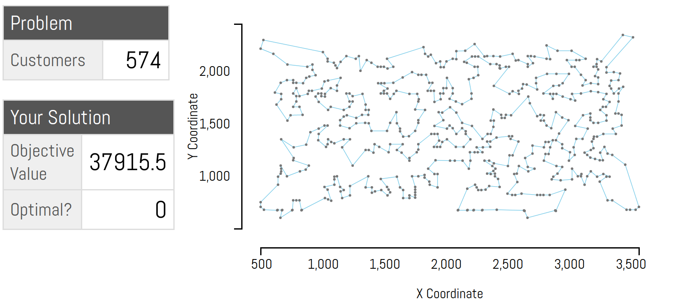

# Discrete Optimization

Algorithms project made in a team of 9. Covered multiple discrete optimization techinques, with a detailed guide on each, and applied to various NP-Hard problems. For detailed information checkout [Overview Slides](Overview_Slides.pdf).

### Introduction
Discrete optimization is essentially a branch of optimization where the variables involved in the modelled problem belong to a discrete set (as opposed to a set of continuous values). The techniques in this domain have immense usage in tackling NP-Hard problems while facing a tradeoff between efficiency and optimization of objective function.

The team was divided into sub-groups and each subgroup studied one of the below techniques extensively:
- Constraint Programming
- Local Search
- Linear Programming and MIP

**The final end-products of the project are as follows:**
* Guides (our notes) on the following topics: Local Search, Constraint Programming, Linear Programming and Branch & Bound.
* A solver for metric TSP (accompanied by codes of different techniques)
* A solver for the Facility Location problem
* Attempts of the techniques we learnt on two past-year Google Hashcode problems (teammates achieved great success in solving *Self-Driving Cars*)
* Proposal of a new Judging System

### Guide
The guides can be found in [this folder](./guides)
In addition, the Local Search Guide can be read [here](https://www.notion.so/Local-Search-Guide-6ef1a2c826ca4f608e782c7c807509db).

### Metric TSP solver
We had tried several different techniques and heuristics to improve the best solution we can come up with in reasonable time.
A summary of our notes of the techniques can be found [here](https://www.notion.so/TSP-Specific-heuristics-778c02063f1c4d37b067ed57aaf34454) or [here](TSP-solver/README.md)

The input files on which we measured the performance of our algorithms can be found [here](TSP-solver/data) 
The codes can be found in the following folders: [folder-1](TSP-solver/anmol-codes) and [folder-2](TSP-solver/shash-codes)
The performance results were as follows:

| Technique/Heuristics Used (Score achieved)                        | tc\_51      | tc\_100 | tc\_200     | tc\_574     | tc\_1889    | tc\_33810 |
| ----------------------------------------------------------------- | ----------- | ------- | ----------- | ----------- | ----------- | --------- |
| Polar Sort + LS with naive swaps (Shashwat)                       | 1123        | 95423   | 123760      | 362576      | 7340497     | 5.22E+09  |
| Nearest neighbour (Anmol)                                         | 1313.47     | 183465  | 327452      | 40219.4     | 6601300     | 2.29E+08  |
| Naive 2-approx algo \[Spanning Tree\](Anmol)                      | 622.753     | 27640.7 | 40773.3     | 49176.1     | 444817      | 1.03E+08  |
| 2 opt with 2-approx algo (Anmol)                                  | 446.855     | 22404.4 | 32173       | 38695.7     | 333546      | 1.03E+08  |
| 2 opt with Polar Sort Init (Shashwat)                             | 462         | 22773   | 31887       | 39209       | 349972      | 9.68E+08  |
| Simulated annealing (Restarts + 2 opt ) (Anmol)                   | 429.5302833 | 20800   | 29598.07336 | 37915.47365 | 337185.9848 | 1.03E+08  |
| Simulated annealing (restarts+reheats+nearest neighbor)(Shashwat) | 428.8       | 20957   | 29795       | 38354       | 333440      | 8.04E+07  |
| Guided fast local search w/ nearest neighbor init (Shashwat 48)   | 428.8       | 21285   | 29517.8     | 37683.3     | 326523      | 6.97E+07  |
| Guided local search + 2-approx algo(Anmol 50)                     | 428.872     | 20750.8 | 29453.2     | 37286.8     | 331390      | \-        |

**Visual outputs for each technique/heuristic can be found in the respective folders for the different heuritics.**

  

## Judging system
Our proposal for a improved judging system with specific use cases where it might be better than current systems can be found [here](https://www.notion.so/Judging-System-61dfd9518f70436ba206c0fe087b94ee).
Please find the performace comparison of our techniques with the *best values obtained by researchers (labelled as "best obtained value yet")* [here](JudgingSystem/MFAS_LOLIB_performance_comparison.pdf)

## Google Hashcode performances
Please checkout the respective folders for our attempts and our experience.
