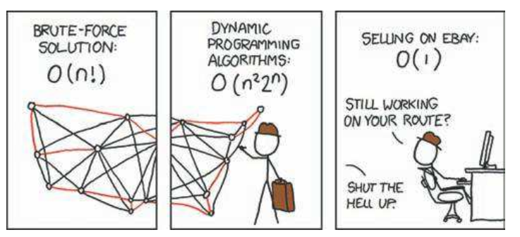

# TSP Specific heuristics

## Description

The travelling salesman problem asks the following question: "Given a list of cities and the distances between each pair of cities, what is the shortest possible route that visits each city exactly once and returns to the origin city?"



If someone hands us a solution, then we can check easily that it does lead to the value it claims and is it a valid ordering. This property makes the TSP a member of the class known as NP, consisting of all problems for which we can check the correctness of a solution in polynomial time. The pair of letters stands for non-deterministic polynomial. The unusual name aside, this is a natural class of problems: when we make a computational request, we ought to be able to check that the result meets our specifications.

# Strategies used

## Nearest neighbour

Nearest Neighours (NN) is one of the simplest search heuristics out there. It is part of the family of constructive search heuristics, meaning that it gradually builds a route. Starting with one city and stopping only when all cities have been visited. It is greedy in nature; at each step it chooses the location that is closest to the current location.

## Using approximation algorithm (2 factor approximation)

Some graph related terms for understanding:

A sequence :  ${\displaystyle v_{0},e_{1},v_{1},e_{2},\dots ,v_{n-1},e_{n},v_{n}}$ where $v_{i}$ are vertices, ${\displaystyle e_{i}}$ are edges, and for all ${\displaystyle i}$ the edge ${\displaystyle e_{i}}$ connects the vertices ${\displaystyle v_{i-1}}$ and ${\displaystyle v_{i}}$ and such a sequence is called a **walk**. 

A walk with no repeated edges is called a **tour**.

A walk with no repeated vertices is called a **path.**

A walk or a tour where ${\displaystyle v_{0}=v_{n}}$   is called **closed.**

A circuit is path that begins and ends at the same vertex.

**Euler tour** is defined as a way of traversing tree such that each vertex is added to the tour when we visit it (either moving down from parent vertex or returning from child vertex). We start from root and reach back to root after visiting all vertices.

**Hamilton Circuit**: a circuit that must pass through each vertex (except the first vertex is obviously visited twice) of a graph once and only once.

In other words,  Hamiltonian circuit is a circuit that visits every vertex once with no repeats. Being a circuit, it must start and end at the same vertex.

Now that the terminology was clear, the actual approximation can be talked about.

### 2-approximation for Metric TSP:

**Input:** A **complete graph** $G(V, E)$, where the vertices are the cities

**Output desired:** A Hamiltonian cycle of minimum cost.

Our graph is  $K_n$ and has $n!$ Hamiltonian cycles. This is trivial to verify as  there are $n$ choices for the starting vertex, then $(n − 1)$ choices for which vertex to visit next, then $(n − 2)$ choices for which vertex to visit next and so on. Because the graph is complete, there will always be an edge that is capable of taking us to the next projected vertex. After the final vertex, one can easily use the edge that connects back to the starting vertex.

Since G is complete and hence connected, I was able to find a minimum spanning tree for the input graph. I used the **Prim's algorithm** to find the minimum spanning tree as using other standard MST algos like Kruskal would have required me to **store the weights of ${N}\choose{2}$ edges and in cases where $N$ is quite large $\approx 10^4$,** my program would have run out of memory. Also, distance calculation between vertices $v_i$ and $v_j$ was trivially $O(1)$ using distance formula.

**Objective is to find the minimum cost Hamiltonian cycle**

The key observation is to observe the satisfaction of the **triangle inequality** by the edges. This version of TSP is known as **METRIC TSP**.

So, the following properties are satisfied:

$$d(v_i,v_j)>=0 \\d(v_i,v_j)=d(v_j,v_i)\\d(v_i,v_j)+d(v_j,v_k)>=d(v_i,v_k)$$

The METRIC TSP problem is also **NP-HARD.**

Let the MST obtained be $T$.

Let the minimum cost Hamiltonian Cycle be $H^*$. Let $e_h$ be an edge in $H^*$.

Let $T$ be rooted at some vertex $v_0$.

Now, we find a Euler tour of $T$ rooted at $v_0$ by making a DFS traversal and storing the vertex ordering in a list $L$. We see that each edge in $T$ is repeated twice in $L$ and so the following holds:

$$c(L)=2*c(T) \tag{1}
$$

Now, we traverse through the list L and retain only the first occurrence of each vertex in this list, and also retain the last vertex in the list, which is $v_0$. **This list can be interpreted as a cycle $C$ in G, because each vertex occurs exactly once in the list except for the first vertex, which also occurs in the end.**

Now, if L contains the sub-sequence $v_i,v_r,v_j$ where $v_i,v_j$ are being visited for the first time whereas $v_r$ is a repeated vertex,  then C contains the sub-sequence $v_i,v_j$. So, now by triangle inequality, the following holds:

$$d(v_i,v_r)+d(v_r,v_j)>=d(v_i,v_j)$$

and so we can conclude that due to all such sub-sequences of type $v_i,v_r,v_j$ from L and insert $v_i,v_j$ in C instead, we can conclude that :

$$c(C)<=c(L) \\\implies c(C)<=2*c(T) \tag{2}
$$

Also, from the minimum cost Hamiltonian cycle $H^*$, if we remove an edge $e_h$, then $[H^*-{e_h}]$ is also a spanning tree of graph G and so,

$$c(T)<=c([H^*-{e_h}])<=c(H^*) \tag{3}
$$

Using (1),(2) and (3), we get the following:

$$c(C)<=2*c(H^*)$$

Hence, cycle C is a factor 2 approximation of $H^*$.

For a visual understanding, the following example can be used:


MST $T$ of a complete graph


Euler Tour L of the graph


Constructed graph C of Euler Tour L

## 2 opt with approx algo

In above applied strategies, one can clearly see in the visualization of the solutions that there are a lot of edges crossing each other. Now, since we were tackling metric TSP, it was quite intuitive that if 2 crossing edges could be removed and a 2 new edges be introduced instead, then as Professor Kanan would say **“we can do better than the current solution”.**

So, 2-opt becomes a great candidate for a local move.

The main idea behind it is to take a route that crosses over itself and reorder it so that it does not.This move deletes two edges, thus breaking the tour into two paths, and then reconnects those paths in the other possible way.

In the below figure, we see edges $e_1=(b,d)$ and $e_2=(a,c)$ are crossing each other. It is easy to see that if we remove edges $e_1$ and $e_2$ while keeping all remaining edges the same, there are $(\frac{4!}{(2!)(2!)(2!)})=3$ ways to connect the quadruple of vertices $(a,b,c,d)$. However, all of them are not legal and progressive at the same time.

**Alternative 1: Introduce edges** $(b,c)$ **and** $(a,d)$

Clearly, such a move is illegal as the resulting graph is no longer connected.

[https://lh6.googleusercontent.com/m8KhH9u9siaNUBEIa-yggStq_8TB8TQWSszCoE9qll_h3o8aNj17TuLrGRHNbarK8gwHT9xgSMtX5EaBioM5FEKYd4X9iNAZwAUcL9yPdDWhRSUzJ0PXqi0yDyZPkJgkQOFZadjt](https://lh6.googleusercontent.com/m8KhH9u9siaNUBEIa-yggStq_8TB8TQWSszCoE9qll_h3o8aNj17TuLrGRHNbarK8gwHT9xgSMtX5EaBioM5FEKYd4X9iNAZwAUcL9yPdDWhRSUzJ0PXqi0yDyZPkJgkQOFZadjt)

**Alternative 2: Introduce edges** $(a,c)$ **and** $(b,d)$

**This is redundant as the original configuration is obtained and hence, we essentially made no progress.**

[https://lh3.googleusercontent.com/gQhu8Jw_0PqWN0DTFCIUc8HqOvBh2mcbWsex50e3TU-6M15W-tvtxofNt_YkyCdwjk-UokTA6PFY8nlP9crzSr_8npcUdqc2DCcaBOfgDZq8125_JRs_WE86qcsfQnpvAyp7UBls](https://lh3.googleusercontent.com/gQhu8Jw_0PqWN0DTFCIUc8HqOvBh2mcbWsex50e3TU-6M15W-tvtxofNt_YkyCdwjk-UokTA6PFY8nlP9crzSr_8npcUdqc2DCcaBOfgDZq8125_JRs_WE86qcsfQnpvAyp7UBls)

**Alternative 3: Introduce edges (b,c) and (a,d)**

This move seems to remove the 2 edges crossing each other and to introduce 2 new valid edges.

[https://lh5.googleusercontent.com/wY7GP5TKK6d1f0dxjliuZRBYab3YZMxbx35xpEVMsiMrI7WVlGGMT6qPizBLVU1iU8v7eop2ga-Prw-i5a2SKwqQ96oWk0HEKrFDUfpKhvSclAQ-UkW2mHjz0hheayE0R-7zkayB](https://lh5.googleusercontent.com/wY7GP5TKK6d1f0dxjliuZRBYab3YZMxbx35xpEVMsiMrI7WVlGGMT6qPizBLVU1iU8v7eop2ga-Prw-i5a2SKwqQ96oWk0HEKrFDUfpKhvSclAQ-UkW2mHjz0hheayE0R-7zkayB)

Thus, among all the 3 possible moves, only the 3rd alternative is both progressive and legal.

Implementation wise, I iterate over the initial solutions generated by using the MST 2 factor approximation. For each initial solution, I keep applying 2-opt as a local move as long as there is at least one possible 2-opt move which **leads to an improvement over the current configuration**. Otherwise, the program gets stuck in a local minima and the program starts the next iteration with a new starting initial solution. **If there are several possible 2-opt moves, one can either choose the one which gives the best improvement or the one which is discovered first.**

**On observing more closely, a 2-opt move is equivalent to reversing the order of the cities between the two edges and hence, in order to maintain the cyclicity of the tour of directed edges, a segment reversal needs to be performed.**

[https://lh3.googleusercontent.com/BxIicTk-qrBifWJkI_PqH2eXcyAcQzYIKKDulfV_cWJFhLkufQOBOYwJhsVTgoaFn_DfPR7F11VqSviIn57bYbw4N3u8BUFtX7MFY_NxQCK99DHvq8tsLmtMYS6GKF5JydWd7-Zh](https://lh3.googleusercontent.com/BxIicTk-qrBifWJkI_PqH2eXcyAcQzYIKKDulfV_cWJFhLkufQOBOYwJhsVTgoaFn_DfPR7F11VqSviIn57bYbw4N3u8BUFtX7MFY_NxQCK99DHvq8tsLmtMYS6GKF5JydWd7-Zh)

For a general cost function, in order to check whether a tour is 2-opt optimal we check ${V}\choose{2}$ie $O(|V|^2)$ pairs of edges. For each pair, the work required to see if the switch decreases the tour cost can he performed in constant time. Thus, the amount of time required to check a tour for 2-optimality is $O(|V|^2)$.

For implementation specific details, let us assume a fixed orientation of the tour, with each tour edge having a unique representation as a pair $(a,b)$, where $a$ is the immediate predecessor of $b$ in tour sequence. Then each possible 2-Opt move can be viewed as corresponding to a 4-tuple of cities $< t_1 ,t_2 ,t_3 ,t_4 >$, where $(t_1 ,t_2 )$ and $(t_4 ,t_3 )$ are the oriented tour edges deleted and ${(t_2 ,t_3)}$ and ${(t_1 ,t_4)}$ are the edges that replace them.

SO, if ordering is  $(t_1, t_2, t_8,t_9,t_{10},t_{11}, t_4,t_3)$;

Then new ordering involve reversing sequence starting from $t_2$ and ending at $t_4$. So, new ordering will be  $(t_1, t_4, t_{11},t_{10},t_{9},t_{8}, t_2,t_3)$.

Also, he move can be evaluated as follows:

**Original cost of joining the tuple $<t_1,t_2,t_4,t_3>$ is $dis(t_1,t_2) + dis(t_3,t_4)$.**

Suspected **cost after 2-opt move for the tuple $<t_1,t_2,t_4,t_3>$ is $dis(t_1,t_4) + dis(t_2,t_3)$.**

So, a 2-opt move will lead to an improvement only if :

$$dis(t_1,t_4) + dis(t_2,t_3) < dis(t_1,t_2) + dis(t_3,t_4)$$

```cpp
bool try_2_opt()
{
    int i, j, t1, t2, t3, t4;
    int pos1 = -1, pos2 = -1;
    double now, poss;
    double diff = -1;
    double max_diff = -1;
    for (t2 = 0; t2 < n; t2++)
    {
        for (t4 = t2 + 1; t4 < n - (t2 == 0); t4++)
        {
            t1 = ((t2 - 1) + n) % n;
            t3 = (t4 + 1) % n;
            now = dist(v[t1], v[t2]) + dist(v[t3], v[t4]);
            poss = dist(v[t1], v[t4]) + dist(v[t2], v[t3]);
            diff = now - poss;
            if (diff > 0)
            {
                if (diff > max_diff)
                {
                    max_diff = diff;
                    pos1 = t2;
                    pos2 = t4;
                }
            }
        }
    }

    if (pos1 == -1 || pos2 == -1)
    {
        return false;
    }
    else
    {
        // debug(pos1);
        // debug(pos2);
        tot -= max_diff;
        modify_vector(pos1, pos2);
        return true;
    }
}
```

---


Without 2opt heuristic, observe the large number of edges crossing each other


2-opt succeeds in removing all edges crossing each other

---


**Dataset of 200 vertices without 2-opt**


**Dataset of 200 vertices with 2-opt**

## Simulated annealing (along with setting of parameters)

## **Borrowing from Physics and Biology**

**The key feature of simulated annealing is that it provides a means to escape local optima by allowing hill-climbing moves (i.e., moves which worsen the objective function value) in hopes of finding a global optimum.**

### Origin of this strategy

It imitates the annealing process used in metallurgy. Generally, when a substance goes through the process of annealing, it is first heated until it reaches its fusion point to liquefy it, and then slowly cooled down in a control manner until it solids back. The final properties of this substance depend strongly on the cooling schedule applied; if it cools down quickly the resulting substance will be easily broken due to an imperfect structure, if it cools down slowly the resulting structure will be well organized and strong.

When solving an optimization problem using simulated annealing the structure of the substance represents a codified solution of the problem, and the temperature is used to determined how and when new solutions are perturbed and accepted. The algorithm is basically a three steps process: perturb the solution, evaluate the quality of the solution, and accept the solution if it is better than the new one.

[https://lh5.googleusercontent.com/WZOhkDNz6RrFUmcj2PUCSZXI6oAO1UMArviS2XmsaqvfMMaojUk85rkAvEpjdzlIPdIH5JWIpo6j9TEryE0aR5IyvLZvEVTVvCBHLQQfL_kcBE51FqplIIg9aZVp43lCbz6XX3Lq](https://lh5.googleusercontent.com/WZOhkDNz6RrFUmcj2PUCSZXI6oAO1UMArviS2XmsaqvfMMaojUk85rkAvEpjdzlIPdIH5JWIpo6j9TEryE0aR5IyvLZvEVTVvCBHLQQfL_kcBE51FqplIIg9aZVp43lCbz6XX3Lq)

Example taken from paper ' Practical considerations of Simulated Annealing' by Ledesma and Sanchez

The method of simulated annealing can be easily understood by observing the above figure which shows a hermetic box with an internal uneven surface (with peaks and valleys), and a ball resting on this surface. **The objective is to move the ball to a position as close as possible to the bottom of the box.** At the beginning of the process the temperature is high and strong perturbations are applied to the box allowing the ball to easily jump over high peaks in search of the bottom of the box. Because of the high energy applied, it is possible for the ball to go down or up easily. As time goes by, the temperature decreases and the **ball has less energy to jump high peaks**. When the temperature has decreased to the point when the ball is able to jump only very small peaks, the ball should be hopefully very close to the bottom of the box and the process is completed.

**Annealing schedule.** 

Determining the initial value of T requires experimentation. I first tried to determine the range of values of ∆E that will be encountered from move to move. I observed the values of $\delta(cost)$ for the first few local moves and set the value of T larger than the largest among them. **I hold each new value of T constant for, say, 1000N reconfigurations, or for 100N successful reconfigurations, whichever comes first.**

There are two possible typical cooling schedules in the literature: exponential and linear.

In a typical exponential cooling, the process spends little time at high temperatures, and as the temperature decreases more and more time is spend at each temperature, allowing the algorithm to refine very well the solution found at high temperatures.

On linear cooling, the temperature decreases linearly as the time increases, thus, the algorithm spends the same amount of time at each temperature.

**I have used an exponential decrease in temperature with the new_temp = (TFACTR) * current temperature.**

After much experimentation, I set TFACTR as 0.9.

**How exactly does T govern the acceptance of a particular move ?**

If S is the original candidate solution and R its newly tweaked child. 

If R is better than S, we’ll always replace S with R as usual.

But if R is worse than S, we may still replace S with R with a certain probability $P(T, R, S)$:

$$P(T, R, S) = e^{-\frac{( cost(R)−cost(S)}{ T}} \:\:where\:\: T ≥ 0.$$

**This equation is interesting in the following ways.**

- Note that the fraction is negative because R is worse than S. First, if R is much worse than S, the fraction is larger, and so the probability is close to 0. If R is very close to S, the probability is close to 1. Thus if R isn’t much worse than S, we’ll still select R with a reasonable probability.
- If current prospected neighbour is worse and T is close to 0, the fraction is again a large number, and so the probability for a degrading move is close to 0. So, the probability of making a degrading move towards the end of the journey is practically null.
- If current prospected neighbour is worse and T is high, the probability of making a degrading move is close to 1.

In cases specific to the TSP assignment on Coursera, I found the delta(cost) to be quite closely related to the order of the magnitude of the coordinates. Eg:  T will be higher if the coordinates are ~ $10^6$ but T is considerably lower when coordinates are ~ $10^2$.

## Guided fast local search

A  thorough mention of this can already be found in the LS NOTES